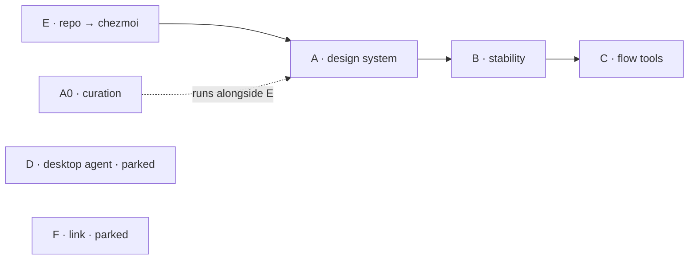

# roadmap

Backlog for the desktop rice / dotfiles overhaul: one coherent visual
identity across every surface, the same config on `desktop` (Fedora +
Hyprland) and `pentest` (Parrot notebook), a repo other devs can install
without breaking their machine, and a small set of tools that keep the
day-to-day in a flow state.

Detailed specs land under `docs/` per track, as each one starts. This
file stays the map.

## how to use this file

- **Append freely.** This file *is* item **C2** — new ideas go straight
  here, no session needed. Keep the table format.
- **Status:** `todo` · `wip` · `done` · `parked`
- **Effort:** `S` (< 1 session) · `M` (1–2) · `L` (3+ / multiple)
- Nothing gets built until its track's spec is written and reviewed.
- Order of attack: **E → A → B → C**. **D** and **F** are parked — a
  1–2 page requirements doc now, build later.

## principles

Every item honours these. If an item can't, it goes back to design.

| #  | Principle |
| -- | --------- |
| P1 | **Legible > clever.** Small, focused, commented configs. Every generated file carries a header: *generated by X — regenerate with Y — do not hand-edit.* |
| P2 | **Scale by single edit.** A new theme surface, a new machine, or a new package means editing **one** place, not N. |
| P3 | **Secure by default.** Secrets never land in plaintext in the repo. `apply` never runs `sudo` silently. A guest install never touches anything outside its scope. |
| P4 | **Self-serve.** Each track ships a `docs/<track>.md`: where it lives, what it does, how to test a change, how to revert. No session needed to change something. |
| P5 | **Reversible.** Pre-`apply` backup + mandatory `chezmoi diff` + documented rollback. (Preserves today's "Stow refuses to overwrite" guarantee.) |
| P6 | **Stable / performant.** Graceful degradation, no heavy reloads, measured on the i3-6300 / GTX 1660S. |

---

## track E — repo → chezmoi + onboarding  *(foundation)*

**Why:** GNU Stow gives dumb symlinks and one flat set of packages. It
can't template per-machine, can't carry secrets, can't bootstrap
packages/services, and can't cleanly separate "the rice anyone can take"
from "my monitor layout". chezmoi does all four; matugen and the theme
pipeline become plugins on top of it.

**Current state:** Stow, hosts `desktop` (Fedora/KDE→Hyprland),
`pentest` (Parrot/KDE), `server` (Debian headless). The `hypr` package is
`desktop`-only today; part of E is making the portable layer reach
`pentest`.

The repo gains **three explicit layers:**

| Layer | Contents | Who gets it |
| ----- | -------- | ----------- |
| **1 — portable rice** | tokens/theme, bar, terminal, launcher, generic binds | anyone who installs |
| **2 — machine profile** | monitors, GPU env, scale, autostart, i3-6300/1660S tuning | only the matching host (templated) — never another dev's default |
| **3 — personal** | daily workflow, project switcher, secrets | opt-in or gitignored/encrypted |

| Id   | Item | Status | Effort | Deps |
| ---- | ---- | ------ | ------ | ---- |
| E0   | Spike: chezmoi vs yadm in a throwaway dir → documented decision | todo | S | — |
| E1   | Migrate repo to chezmoi source layout (`dot_config/…`, `private_`/`executable_`/`run_once_` prefixes). `chezmoi apply` reproduces `$HOME` **identically**. | todo | L | E0 |
| E1a  | Safe-apply guard: mandatory `chezmoi diff` + auto-backup of any file `apply` would overwrite | todo | S | E1 |
| E2   | Three layers + `.chezmoi.toml.tmpl` prompting `personal \| guest` at `chezmoi init` | todo | M | E1 |
| E3   | Idempotent bootstrap scripts: package install + `systemctl --user enable` in the same `apply` | todo | M | E2 |
| E3a  | Package-manager abstraction: `dnf` (Fedora) vs `apt` (Parrot), shared package list | todo | S | E3 |
| E4   | Secrets: `encrypted_` (age) or password-manager templates | todo | S | E1 |
| E5   | Onboarding wizard: install layer 1, then prompt monitors / scale / keyboard layout → generate layer 2 for that machine | todo | M | E2 |
| E6   | Docs: README quickstart, "restore on a new machine", CONTRIBUTING, CLAUDE.md matching the other repos' style | todo | S | E1 |

**Done when:** (a) clean Fedora VM + one command → full desktop back;
(b) the Parrot notebook runs the same layer 1; (c) a guest dev installs
and **nothing** on their machine breaks — monitors, GPU, personal config
all untouched.

---

## track A — design system

**Why:** today only accent + border colours are themed; everything else
is toolkit default — that's the "generic identity" complaint. Fix is a
single token contract every surface consumes the same way (kills
"inconsistency between surfaces"), plus a fixed non-colour identity
(type, shape, density, motion, bar composition) that *doesn't* move with
the wallpaper.

**Colour philosophy:** build the engine of "swappable authored themes"
with **matugen-from-wallpaper as one selectable provider**. Same command,
same output format; surfaces don't know which provider ran.
`theme use wallpaper` → dynamic (today's behaviour). `theme use rose` →
hand-crafted palette. Day-to-day dynamic; lock a signature palette for
streams/screenshots/focus.

| Id   | Item | Status | Effort | Deps |
| ---- | ---- | ------ | ------ | ---- |
| A0   | Curation: references → lock non-colour identity (typography, shape, density, motion, bar) + mood → `docs/style-guide.md` | todo | M | — *(alongside E)* |
| A1   | Token contract: roles + states, single source + schema (formalises `theme.json`) | todo | M | A0 |
| A2   | Provider layer: `theme use wallpaper` (matugen) \| `theme use <static>` | todo | M | A1 |
| A3   | First authored palette, hand-built to the contract | todo | S | A1 |
| A4   | Propagation per surface via chezmoi templates: hypr, grootshell, mako, kitty, GTK3/4, Qt (Kvantum/qt6ct), rofi/wofi, hyprlock, cursor, **fastfetch** | todo | L | A2, E1 |
| A5   | `theme regenerate` re-renders everything atomically + coherence check | todo | S | A4 |

**Non-colour identity picks (feed A0 → A4):**

- Mono font: **JetBrains Mono**. UI/text font: TBD in A0.
- GTK theme + **icon theme** + **cursor theme**: picks separate from
  matugen; applied via `gsettings` / `index.theme` in the A4 templates.
- **Borderless windows** — recorded intent. ⚠️ supersedes today's
  "wallpaper-derived border" feature and grootshell `border.thickness: 4`.
  Confirm in A0 (borderless, focus shown via gap/shadow/dim — vs a 1px
  minimal border).
- fastfetch: custom config consuming tokens + logo/ASCII choice (small
  A4 item).

**Done when:** switching profile → every surface changes coherently, zero
manual steps, zero broken app.

### A0 — inputs

Reference rices to mine for *features and configs* (not repo structure —
most use an installer script, not chezmoi):

- `~/Imagens/rice/i3-imac-g4-from-2003-running-2026-applications-v0-8l5n0mxsz5oh1.webp`
  — i3 + `spotify_player` TUI, blue scheme, iMac G4 build
- `~/Imagens/Screenshots/scr-20260910-070525.png` — recent screenshot ref
- bottom (btm) in an amber/CRT scheme — *add source link*
- fastfetch layout ref — *add source link*
- My sweep (A0 session): end-4/dots-hyprland, Caelestia, HyDE, ML4W,
  prasanthrangan/hyprdots, r/unixporn top Hyprland, matugen showcase,
  Quickshell widget galleries.
- *(add your own links here)*

---

## track B — stability & performance

| Id | Item | Status | Effort | Deps |
| -- | ---- | ------ | ------ | ---- |
| B1 | `dotfiles doctor`: configs parse, services up, fonts present, theme coherent | todo | M | E1 |
| B2 | CI: shellcheck, stylua, JSON-schema for `*.json` configs, `chezmoi execute-template` dry-run | todo | M | E1 |
| B3 | `systemd --user` units with `Restart=` + wallpaper/theme fallback | todo | S | — |
| B4 | Perf pass: startup cost + animation timings, measured on i3-6300/1660S | todo | S | — |

**Done when:** break a config on purpose → doctor catches it, nothing
cascades.

---

## track C — flow tools

| Id | Item | Status | Effort | Deps |
| -- | ---- | ------ | ------ | ---- |
| C1 | `rice` CLI/menu: single entrypoint — theme, wallpaper, toggles (focus/game/record), scratchpads, project switcher, clipboard | todo | M | A2 |
| C2 | This `ROADMAP.md` as the source of small QoL items | wip | S | — |
| C3 | Loose items as they come up | todo | — | — |
| C4 | Terminal productivity suite: zoxide · tmux+sesh (zellij-level UX) · spotify-player · btop | todo | M | E1, A4 |
| C5 | Editor: LazyVim, themed, with `lazy-lock.json` committed | todo | M | E1, A4 |

Each C4/C5 tool touches 4 places in track order: package list (E3/E3a) →
dotfiles package (E1) → theme (A4) → keybind/launcher (C1).

**C4 notes:**
- **zoxide** — shell integration in `.bashrc.d`; yazi already depends on
  it, so partly present.
- **tmux + sesh**, customised to zellij-level UX *(decided)*: keybind-hint
  status bar (`tmux-which-key` / `tmux-menus`), floating scratch pane
  (`display-popup` / `tmux-floax`), session-picker popup (sesh + fzf),
  better copy-mode (`extrakto` / `tmux-thumbs`), themed status line (A4).
  Plugins via tpm, pinned/vendored for reproducibility (P1/P5).
- **spotify-player** (Rust, matches the screenshot) or **ncspot** — both
  need Premium (librespot). Sibling of yt-x.
- **btop** *(decided, was bottom/btm)* — better theme support, matugen
  templates exist; themed in A4.

**Done when:** common daily actions = one keybind/command, documented.

---

## parking lot

Requirements doc only for now. No build.

### D — desktop agent

Hotkey → overlay (Quickshell/grootshell) with chat + voice, reads/acts on
local files. Likely a wrapper over `opencode` / Claude Code rather than
from scratch (`opencode` already installed). Big; deliberately deferred.
Deliverable: 1-page requirements.

### F — "link" (desktop ↔ notebook)

A KDE-Connect-for-PCs, optimised, with more features: mouse/keyboard
sharing, easy file/photo/video send, wallpaper sync, more.

**Preliminary direction — do *not* re-build the protocol.** Existing
pieces:

| Feature | Use |
| ------- | --- |
| mouse/keyboard share | **lan-mouse** (Rust, Wayland-native) · Deskflow (already configured) · Input Leap |
| file/photo/video send | **LocalSend** · KDE Connect · warpinator |
| KDE Connect on Hyprland | already runs (`kdeconnectd` + `kdeconnect-cli`); missing part is the visual integration |

Likely shape: a grootshell panel unifying lan-mouse + LocalSend/KDE
Connect + wallpaper sync, with proper Hyprland integration. Deliverable:
1–2 page requirements.

---

## open decisions

| Decision | Where | Options |
| -------- | ----- | ------- |
| Window borders | A0 | borderless (gap/shadow/dim focus) vs 1px minimal |
| UI/text font | A0 | — |
| Terminal Spotify | C4 | spotify-player vs ncspot |
| chezmoi vs yadm | E0 | — |
| Authored palette names | A3 | e.g. rose / matcha / nord |

### resolved

- **System monitor → btop** (2026-09-10), was bottom/btm.
- **Multiplexer → tmux + sesh** (2026-09-10), customised to zellij-level UX
  rather than adopting zellij.
